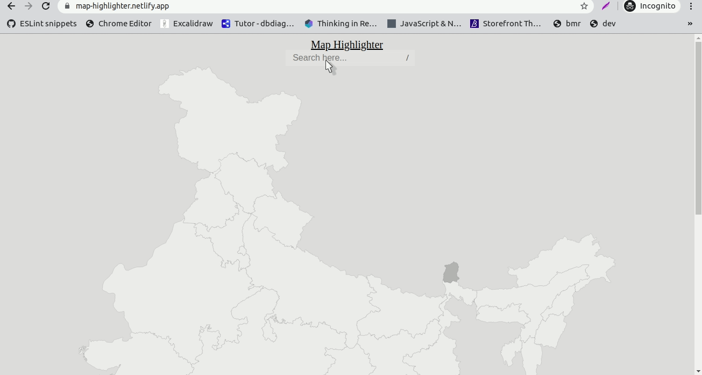

# Map Highlighter

Search Indian state on map.
Press `/` to set the focus to search field.
No third party library dependencies.

## Demo
Live url [Hosted On Netlify](https://map-highlighter.netlify.app/)

## Installation

- Just clone the master repo.Currently not dependent on any library.

## Roadmap

Future development plans for the plugin (if any suggestion then do create a feature request over GitHub):

- [x] Scroll to matched state.
- [ ] a11y
- [ ] Responsive
- [ ] Tooltip, will show some info related to matched state
- [X] Enjoy ( Always :smile: )

## Support

Found any issue , Please [Create a Github Issue](https://github.com/insaurabh/map-highlighter/issues/new) or send a pull request.

## Learnings while creating this small project
 - [addEventListener](https://developer.mozilla.org/en-US/docs/Web/API/EventTarget/addEventListener) to attach an event on an `DOM` element.
 - [scrollIntoView](https://developer.mozilla.org/en-US/docs/Web/API/Element/scrollIntoView) to scroll the element so that it will be visible to end user.
 - [svg](http://www.petercollingridge.co.uk/tutorials/svg/interactive/javascript/) how to style `svg` using javaScript
## Credits

- Developed by [Saurabh Ranjan](https://github.com/insaurabh/)
- Reset Css by [Meyerweb](http://meyerweb.com/eric/tools/css/reset/)
